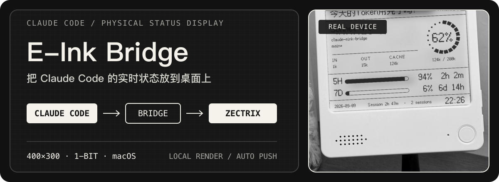
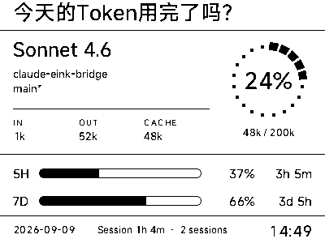

<p align="center">
  
</p>

<p align="center">
  <a href="./README_EN.md">English</a> · macOS · Claude Code · Zectrix
</p>

Claude Code E-Ink Bridge 是 [Claude HUD](https://github.com/jarrodwatts/claude-hud) 与 Zectrix 墨水屏之间的本地桥接器。它读取当前 Claude Code 会话状态，在 Mac 上渲染成 400×300 单色看板，并在数据变化时自动推送到桌面设备。

> 当前仅支持 macOS。需要已可正常运行的 Claude Code、Claude HUD，以及可使用开放 API 的 Zectrix 墨水屏。

## 实际效果

<p align="center">
  
</p>

一块屏幕集中显示：

- 当前模型、项目目录与 Git 分支状态
- 输入、输出与缓存 Token
- 上下文占用量和 5 小时 / 7 天额度
- 额度重置倒计时、会话时长、活跃会话数和更新时间

## 快速开始

### 1. 准备环境

- macOS
- [Claude Code](https://docs.anthropic.com/en/docs/claude-code/getting-started)
- [Claude HUD](https://github.com/jarrodwatts/claude-hud)
- Python 3、Git，以及 Node.js 或 Bun
- Zectrix 设备及其云平台 API 权限

### 2. 一键安装

```bash
curl -fsSL https://raw.githubusercontent.com/BarryBarrywu/claude-eink-bridge/main/install.sh | bash
```

安装脚本会把项目放到 `~/.claude-eink-bridge`，创建 Python 虚拟环境，将 wrapper 接入 Claude Code 的 `statusLine`，并在首次安装时打开配置文件。

### 3. 绑定设备

登录 [Zectrix 云平台](https://cloud.zectrix.com/)，在 `~/.claude-eink-bridge/config.json` 中填写：

```json
{
  "api_key": "YOUR_ZECTRIX_API_KEY",
  "mac_address": "AA:BB:CC:DD:EE:FF",
  "page_id": 5,
  "interval_seconds": 60,
  "greeting": "今天的Token用完了吗？",
  "font_path": "font.ttf",
  "render_mode": "auto"
}
```

其中 `api_key`、`mac_address` 和 `page_id` 是必填项。建议把 Zectrix 设备轮询时间设为 1 分钟，并保留默认的 `interval_seconds: 60`。

### 4. 启动 Claude Code

```bash
claude
```

wrapper 会随 Claude Code 状态栏运行，桥接进程按需启动。没有新会话快照超过 10 分钟后，进程会自动退出；下次启动 Claude Code 时会再次唤醒。

## 工作方式

<p align="center">
  
</p>

- `eink-wrapper.ts` 在保留 Claude HUD 原有输出的同时，最多每 30 秒写入一次会话快照。
- `main.py` 选择最近活跃的会话，在内存中渲染 PNG（默认灰度抗锯齿，可切换 1-bit）。
- 主循环默认每 60 秒检查一次；数据未变化时跳过渲染和网络推送。
- 多个 Claude Code 会话并存时，屏幕显示最近更新的项目，并在底部标出活跃会话数。

## 多个 Claude 配置目录

如果你通过 `CLAUDE_CONFIG_DIR` 使用非默认配置目录，安装器会优先采用显式参数或环境变量；检测到多个目录时也会让你选择。

```bash
# 环境变量
CLAUDE_CONFIG_DIR="$HOME/.claude-team" bash install.sh

# 命令行参数
bash install.sh --config-dir "$HOME/.claude-team"
```

未指定时默认使用 `~/.claude`。

## 配置项

| 配置项 | 必填 | 作用 |
| --- | :---: | --- |
| `api_key` | 是 | Zectrix 开放 API 密钥 |
| `mac_address` | 是 | 目标设备 MAC 地址 |
| `page_id` | 是 | 要覆盖推送的设备页面 |
| `interval_seconds` | 否 | 检查数据并尝试推送的间隔，默认 60 秒 |
| `greeting` | 否 | 顶部问候语，过长时自动截断 |
| `font_path` | 否 | 本地 TTF 字体路径，默认 `font.ttf` |
| `render_mode` | 否 | `auto`（默认）向云端查询屏幕能力：1-bit 面板用 `mono`，其余用 `gray`。也可直接写死 `gray` / `mono` |

## 排查问题

<details>
<summary><strong>屏幕没有刷新</strong></summary>

先生成一次本地预览：

```bash
cd ~/.claude-eink-bridge
source .venv/bin/activate
python main.py --preview
```

如果生成了 `preview-local.png`，说明配置加载和本地渲染路径可以工作。想对比两种渲染模式，可以加上 `--mode`：

```bash
python main.py --preview --mode mono
```

屏幕仍不更新时，重点检查会话快照、`api_key`、`mac_address`、`page_id`、设备联网状态和 Zectrix 轮询设置。
</details>

<details>
<summary><strong>更新代码后没有生效</strong></summary>

Claude Code 运行的是安装到配置目录中的 `eink-wrapper.ts`。重新执行安装命令会保留已有的虚拟环境与 `config.json`，并更新 wrapper：

```bash
curl -fsSL https://raw.githubusercontent.com/BarryBarrywu/claude-eink-bridge/main/install.sh | bash
```
</details>

<details>
<summary><strong>修改配置后如何重启</strong></summary>

```bash
pkill -f main.py
```

然后重新启动 `claude`。桥接器会读取新的配置并按需启动。
</details>

<details>
<summary><strong>如何卸载并恢复原状态栏</strong></summary>

```bash
node ~/.claude-eink-bridge/setup-eink.mjs --undo
```

如果使用了非默认 Claude 配置目录，请在命令前提供相同的 `CLAUDE_CONFIG_DIR`。
</details>

## 项目结构

| 文件 | 作用 |
| --- | --- |
| `eink-wrapper.ts` | 转发 Claude HUD 状态并生成分会话快照 |
| `main.py` | 选择会话、渲染看板并调用 Zectrix API |
| `setup-eink.mjs` | 安装或恢复 Claude Code `statusLine` 配置 |
| `install.sh` / `install.command` | macOS 安装入口 |
| `config.example.json` | 配置模板 |
| `font.ttf` | 默认 MiSans 字体 |

## 关注项目

- [极趣实验室](https://space.bilibili.com/13131424)：Zectrix 墨水屏硬件与桌搭内容
- [最近使用](https://space.bilibili.com/217963572)：项目作者的苹果生态与 AI 效率内容

## License

[MIT](./LICENSE)
