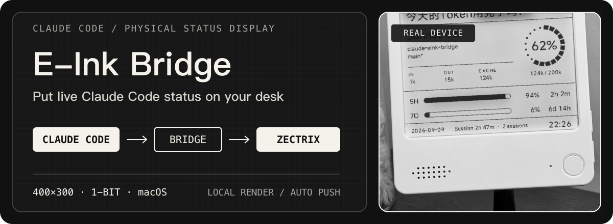
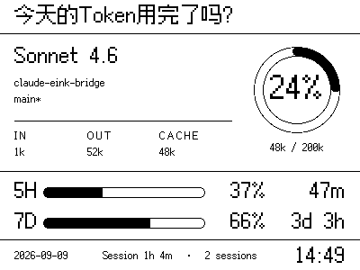

<p align="center">
  
</p>

<p align="center">
  <a href="./README.md">中文</a> · macOS · Claude Code · Zectrix
</p>

Claude Code E-Ink Bridge is a local bridge between [Claude HUD](https://github.com/jarrodwatts/claude-hud) and a Zectrix e-ink display. It reads the active Claude Code session, renders a 400×300 monochrome dashboard on your Mac, and pushes it to the physical device when the data changes.

> macOS only. You need working Claude Code and Claude HUD installations, plus a Zectrix display with Open API access.

## Real output

<p align="center">
  
  
</p>

<p align="center">
  <sub>Left: the default <code>outline</code> typeface　·　Right: <code>typeface: "pixel"</code></sub>
</p>

The display keeps these signals visible at a glance:

- current model, plus project directory and Git branch on a line each;
- input, output, and cached tokens;
- context occupancy and 5-hour / 7-day usage windows;
- reset countdowns, date, session duration, active-session count, and update time.

## Quick start

### 1. Prerequisites

- macOS
- [Claude Code](https://docs.anthropic.com/en/docs/claude-code/getting-started)
- [Claude HUD](https://github.com/jarrodwatts/claude-hud)
- Python 3, Git, and either Node.js or Bun
- a Zectrix display and access to its cloud Open API

### 2. Install

```bash
curl -fsSL https://raw.githubusercontent.com/BarryBarrywu/claude-eink-bridge/main/install.sh | bash
```

The installer clones the project to `~/.claude-eink-bridge`, creates a Python virtual environment, connects the wrapper to Claude Code's `statusLine`, and opens the configuration file on first install.

### 3. Bind the device

Sign in to [Zectrix Cloud](https://cloud.zectrix.com/) and edit `~/.claude-eink-bridge/config.json`:

```json
{
  "api_key": "YOUR_ZECTRIX_API_KEY",
  "mac_address": "AA:BB:CC:DD:EE:FF",
  "page_id": 5,
  "interval_seconds": 60,
  "greeting": "Token exhausted yet?",
  "font_path": "font.ttf",
  "render_mode": "auto",
  "typeface": "outline"
}
```

`api_key`, `mac_address`, and `page_id` are required. For a predictable refresh cadence, set the Zectrix device polling interval to one minute and keep `interval_seconds` at its default value of `60`.

### 4. Start Claude Code

```bash
claude
```

The wrapper runs with Claude Code's status line and starts the bridge on demand. The bridge exits after ten minutes without a fresh session snapshot and wakes again the next time Claude Code runs.

## How it works

<p align="center">
  
</p>

- `eink-wrapper.ts` preserves Claude HUD output while writing at most one session snapshot every 30 seconds.
- `main.py` selects the most recently active session and renders a PNG in memory (anti-aliased greyscale by default, 1-bit on request).
- The main loop checks every 60 seconds by default; unchanged data skips rendering and network delivery.
- When multiple Claude Code sessions are active, the display follows the newest project and shows the active-session count in its footer.

## Multiple Claude configuration directories

If you use a non-default directory through `CLAUDE_CONFIG_DIR`, the installer prefers an explicit flag or environment variable. It also prompts when it discovers multiple candidate directories.

```bash
# Environment variable
CLAUDE_CONFIG_DIR="$HOME/.claude-team" bash install.sh

# Command-line flag
bash install.sh --config-dir "$HOME/.claude-team"
```

Without either option, the bridge uses `~/.claude`.

## Configuration

| Key | Required | Purpose |
| --- | :---: | --- |
| `api_key` | Yes | Zectrix Open API key |
| `mac_address` | Yes | Target device MAC address |
| `page_id` | Yes | Device page to overwrite |
| `interval_seconds` | No | Data check and push interval; defaults to 60 seconds |
| `greeting` | No | Header greeting; long text is truncated |
| `font_path` | No | Local TTF path; defaults to `font.ttf` |
| `render_mode` | No | `auto` (default) asks the cloud what the panel supports: `mono` for a 1-bit board, `gray` otherwise. Set `gray` or `mono` to pin it |
| `typeface` | No | `outline` (default) uses MiSans; `pixel` uses the Ark Pixel bitmap font and lays out on multiples of 12px |
| `pixel_font_path` | No | Bitmap font path; defaults to `font-pixel.ttf` |

## Troubleshooting

<details>
<summary><strong>The display does not refresh</strong></summary>

Generate a local preview first:

```bash
cd ~/.claude-eink-bridge
source .venv/bin/activate
python main.py --preview
```

If `preview-local.png` appears, configuration loading and local rendering are working. To compare the two render modes, add `--mode`:

```bash
python main.py --preview --mode mono
python main.py --preview --typeface pixel
```

If the device still does not update, check the session snapshots, `api_key`, `mac_address`, `page_id`, device connectivity, and the Zectrix polling interval.
</details>

<details>
<summary><strong>Repository updates do not take effect</strong></summary>

Claude Code runs the installed copy of `eink-wrapper.ts`. Run the installer again to preserve the existing virtual environment and `config.json` while updating the wrapper:

```bash
curl -fsSL https://raw.githubusercontent.com/BarryBarrywu/claude-eink-bridge/main/install.sh | bash
```
</details>

<details>
<summary><strong>Apply configuration changes</strong></summary>

```bash
pkill -f main.py
```

Then restart `claude`. The bridge reads the new configuration when it starts on demand.
</details>

<details>
<summary><strong>Uninstall and restore the previous status line</strong></summary>

```bash
node ~/.claude-eink-bridge/setup-eink.mjs --undo
```

For a non-default Claude configuration directory, provide the same `CLAUDE_CONFIG_DIR` before the command.
</details>

## Project map

| File | Role |
| --- | --- |
| `eink-wrapper.ts` | Forwards Claude HUD status and writes per-session snapshots |
| `main.py` | Selects a session, renders the dashboard, and calls the Zectrix API |
| `setup-eink.mjs` | Installs or restores Claude Code's `statusLine` setting |
| `install.sh` / `install.command` | macOS installation entry points |
| `config.example.json` | Configuration template |
| `font.ttf` | Bundled MiSans font |

## Follow the project

- [Jige Lab](https://space.bilibili.com/13131424): Zectrix e-ink hardware and desk setups
- [Barry's channel](https://space.bilibili.com/217963572): Apple ecosystem and AI productivity projects

## License

[MIT](./LICENSE)
