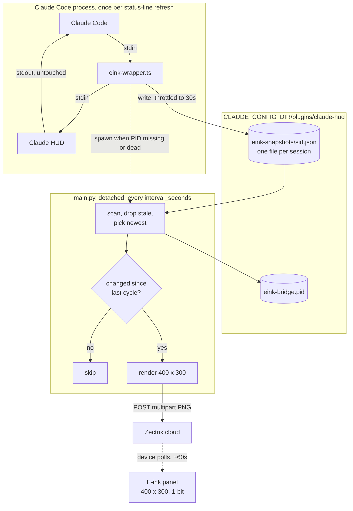
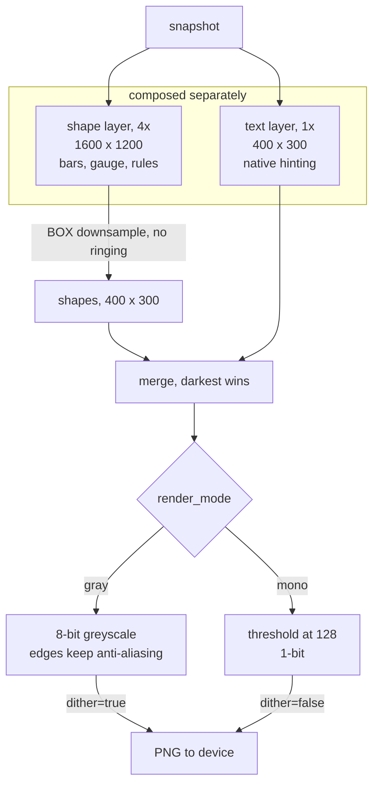

# Specification

Claude Code E-Ink Bridge reads Claude Code session state on macOS, renders it as a
400×300 dashboard, and pushes the image to a Zectrix e-ink display.

This document describes what each file does, the contracts between the pieces, and
the constraints the rendering obeys. It is a reference for changing the project, not
an installation guide — see `README.md` / `README_EN.md` for that.

---

## 1. Target hardware

| Property | Value | Consequence |
| --- | --- | --- |
| Board | `zectrix-s3-epaper-4.2` | ~4.2" panel |
| Resolution | 400 × 300 | fixed canvas size |
| Colour depth | `1bit` | **no grey levels, no anti-aliasing** |
| Pixel density | ~119 DPI | 1px ≈ 0.21 mm |
| Refresh | pull-based | the device polls the cloud; 1 minute is the recommended interval |

The colour depth is reported by the cloud as `screenColor` and is read at startup
(§7). Everything in §6 follows from it.

---

## 2. Architecture

Two processes that never talk to each other directly. They meet at a directory of
snapshot files, which is also what makes the wrapper safe: if the bridge is dead,
misconfigured, or offline, the wrapper still forwards HUD's output and the terminal
is unaffected.



Three properties fall out of this shape:

- **The wrapper is transparent.** It forwards stdin to Claude HUD and HUD's stdout
  onward untouched, so the terminal status line is unaffected whether or not the
  bridge is working.
- **No daemon.** The bridge is started on demand by the wrapper and exits by itself
  after 10 minutes without a fresh snapshot. There is no launchd job to manage.
- **HUD upgrades are transparent.** The wrapper locates the HUD entry point by
  scanning the plugin cache for the highest version number at each invocation.

---

## 3. Files

### Runtime

| File | Purpose |
| --- | --- |
| `main.py` | The bridge. Snapshot scanning, rendering, and the Zectrix push. The renderer (`EinkRenderer`) is the bulk of it. |
| `eink-wrapper.ts` | Sits between Claude Code and Claude HUD. Forwards the stream, writes a per-session snapshot at most every 30s, and starts the bridge if its PID file is stale. Run by Bun, or by `npx tsx` as a fallback. |
| `setup-eink.mjs` | Points Claude Code's `statusLine` at the wrapper and writes `eink-bridge.json` so the wrapper knows which Python and which directory to spawn. `--undo` restores the original `statusLine`. |
| `requirements.txt` | `Pillow` and `requests`. |

### Configuration

| File | Purpose |
| --- | --- |
| `config.example.json` | Template. Copied to `config.json` on first install. |
| `config.json` | Live configuration. Git-ignored; holds the API key. See §4. |

### Fonts

| File | Purpose |
| --- | --- |
| `font.ttf` | MiSans Medium. The default (`outline`) typeface, and the only one that need exist. |
| `font-pixel.ttf` | Ark Pixel 12px Proportional zh_cn — a bitmap font, 18,299 CJK ideographs. Used when `typeface` is `pixel`. |
| `OFL-ark-pixel.txt` | Ark Pixel's SIL Open Font License. Required by its terms; do not remove. |

### Installation

| File | Purpose |
| --- | --- |
| `install.sh` | The `curl … \| bash` entry point. Clones or pulls into `~/.claude-eink-bridge`, builds the venv, runs `setup-eink.mjs`, seeds `config.json`. Resolves which Claude config directory to target (§8). |
| `install.command` | Double-clickable Finder variant, for a repo already downloaded. Does not clone and does not handle `CLAUDE_CONFIG_DIR`. |

### Documentation and images

| File | Purpose |
| --- | --- |
| `README.md` / `README_EN.md` | Chinese and English documentation. |
| `SPEC.md` | This file. |
| `preview.png` / `preview-pixel.png` | 400×300 renders shown in the READMEs, one per typeface. Generated, not photographed. |
| `assets/readme/hero.png` / `hero-en.png` | README banners. Composites of the layout SVG and the device photo. |
| `assets/readme/source/hero-layout*.svg` | Banner layout. References `hero-device.jpg` relatively and draws the `REAL DEVICE` badge over it. Rendered with `rsvg-convert`. |
| `assets/readme/source/hero-device.jpg` | The device photograph used in the banners. |
| `assets/readme/workflow*.svg` | The data-flow diagram in the READMEs. |
| `device.jpg` | Full-resolution device photograph. Not referenced by either README. |
| `LICENSE` | MIT, covering the project's own code. |

---

## 4. Configuration

`config.json`, read once at startup from the directory containing `main.py`.

| Key | Required | Default | Meaning |
| --- | :---: | --- | --- |
| `api_key` | yes | — | Zectrix open-API key. |
| `mac_address` | yes | — | Target device, `AA:BB:CC:DD:EE:FF`. Matched case-insensitively against `deviceId`. |
| `page_id` | yes | — | Device page to overwrite. |
| `interval_seconds` | no | `60` | Seconds between snapshot checks. |
| `greeting` | no | `今天的Token用完了吗？` | Header text. Shrinks to fit before it truncates. |
| `font_path` | no | `font.ttf` | Outline typeface. Relative paths resolve against `main.py`. |
| `pixel_font_path` | no | `font-pixel.ttf` | Bitmap typeface. |
| `render_mode` | no | `auto` | `auto` \| `gray` \| `mono`. See §7. |
| `typeface` | no | `outline` | `outline` \| `pixel`. See §6.4. |

Missing required keys exit with status 1. An unknown `render_mode` or `typeface`
falls back to its default with a warning rather than failing. Selecting `pixel`
without the font file present falls back to `outline`.

CLI flags override the file for one run: `--mode`, `--typeface`. Other flags are
`--once` (push once and exit), `--preview` (write `preview-local.png`, no network),
and `--debug` (dump each snapshot).

---

## 5. The snapshot contract

The wrapper writes one file per session to
`$CLAUDE_CONFIG_DIR/plugins/claude-hud/eink-snapshots/{sid}.json`, where `sid` is
the first 8 hex characters of the MD5 of the session's working directory. Writes
are throttled to one per 30 seconds per session.

```jsonc
{
  "timestamp":        "2026-09-09T14:49:00.000Z",  // header date + footer clock
  "sessionStartedAt": "2026-09-09T13:45:00.000Z",  // preserved across writes
  "sessionId":        "a1b2c3d4",
  "model":            "Sonnet 4.6",
  "project":          "/Users/dev/PersonalProjects/claude-eink-bridge",
  "context": {
    "percent":      24,        // 0-100, the gauge
    "windowSize":   200000,
    "totalTokens":  48231,
    "inputTokens":  1204,
    "outputTokens": 52310,
    "cacheTokens":  48012      // creation + read
  },
  "usage": {                   // null when Claude Code reports no rate limits
    "fiveHour":        37,
    "sevenDay":        66,
    "fiveHourResetAt": "2026-09-09T18:00:00.000Z",
    "sevenDayResetAt": "2026-09-12T21:00:00.000Z"
  },
  "git":             { "branch": "main", "isDirty": true },  // null outside a repo
  "sessionDuration": "1h 4m"
}
```

The renderer treats every field as optional and degrades rather than raising:
a missing `usage` prints "No rate-limit data"; a missing snapshot entirely draws
the waiting screen.

**Session start is preserved** across writes so `sessionDuration` accumulates. It
resets when the previous snapshot is more than an hour old, which is read as a new
session.

`main.py` scans the directory each cycle, deletes snapshots older than
`STALE_THRESHOLD` (3600s), renders the most recently modified one, and reports the
count of live snapshots as the session count.

---

## 6. Rendering

### 6.1 Pipeline

Two planes are composed separately and merged at the end:

- **Shapes** are drawn on a layer 4× the canvas (`SS = 4`) and box-filtered down.
  Box, not Lanczos — an exact area average with no ringing halos.
- **Text** is drawn at native size, where the font's own hinting applies.

They are kept apart because they want opposite treatment. Supersampling a curve
improves it; supersampling a glyph throws away the hinting that makes it crisp at
12px. Keeping the planes separate also means a future output mode can threshold one
and dither the other.



`render_mode: auto` resolves to one of these two branches once, at startup, from the
panel's reported colour depth (§7). Because nothing is drawn in a mid-tone (§6.2),
the two branches differ only at glyph and curve edges.

### 6.2 No mid-tones

**Nothing is drawn in a grey.** Unfilled progress bars and the gauge track are
hairline outlines and dots; filled portions are solid; rules are solid.

This is not a stylistic preference. A flat mid-grey has to be dithered somewhere —
by this code or by the panel — and at 119 DPI with e-ink's contrast ratio the
resulting halftone reads as dirt rather than as a lighter shade. It was tried and
rejected on hardware.

The consequence is that `gray` and `mono` differ only in whether glyph and curve
edges keep their anti-aliasing.

### 6.3 Curves

A 1px curve is the worst case on a 1-bit panel: it breaks into an uneven staircase
with nothing thick enough to absorb the error. Two rules follow:

- The context gauge is **segmented** — one solid block per 5% used, one square dot
  per 5% remaining. Blocks are thick enough that their stepping reads as
  deliberate; dots are axis-aligned squares snapped to whole pixels, so every one
  is identical and none staircases.
- Progress bars are pills with a **clipped** fill: a rounded mask limited to the
  fill width, rather than a rounded rectangle that degenerates at low percentages.

### 6.4 Typefaces

Fonts are selected by **role**, not by size. Each role lists candidates in order of
preference and the first whose rendering fits the available width wins — which is
how the greeting lands at 24px in Chinese and 12px for a long English one.

| | `outline` | `pixel` |
| --- | --- | --- |
| Font | MiSans Medium | Ark Pixel 12px |
| Sizes | free | **multiples of 12 only** |
| Glyph origins | sub-pixel | snapped to whole pixels |
| Look | conventional | deliberate, terminal-like |

Ark Pixel is drawn on a 12px grid. Rendering it at any other size resamples the
bitmap: stems come out at alternating 1px and 2px, which is exactly the unevenness
a bitmap font is adopted to avoid. Requests for 1.5× therefore step to 2×, not to
18px. Glyph origins are rounded for the same reason — a bitmap drawn at a
fractional offset resamples to mush.

`LAYOUT_OVERRIDES` widens the rate-limit columns under `pixel`, whose characters are
wider.

### 6.5 Tabular figures

MiSans' digits are proportional — `1` is 15 units where `0` is 23. On a display that
redraws every minute, `9%` → `10%` reflowing the line reads as jitter. Numeric
fields are therefore drawn character by character on a uniform digit advance
(`_tab`). Ark Pixel's digits are already uniform, so this costs nothing there.

Text that must sit inside a shape is centred on its **measured ink bounds**
(`_tab_centered`), not on a hand-tuned baseline offset, so it self-centres for any
font at any size.

### 6.6 Layout grid

400 × 300, four bands separated by 1px rules at y = 37, 190, 266.

```
  0 ┌──────────────────────────────────────────────┐
    │  greeting                                    │  header, baseline 25
 37 ├──────────────────────────────────────────────┤
    │  model                        ╭────╮         │  baseline 70
    │  project                      │ 24%│         │  baseline 96
    │  branch                       ╰────╯         │  baseline 114
    │  ─────────────────            48k / 200k     │  rule 134, caption 168
    │  IN      OUT      CACHE                      │  baseline 155
    │  1k      52k      48k                        │  baseline 173
190 ├──────────────────────────────────────────────┤
    │  5H  ▓▓▓░░░░░░░░░       37%      3h 5m       │  rows at 197, 231
    │  7D  ▓▓▓▓▓▓░░░░░░       66%      3d 5h       │  height 34
266 ├──────────────────────────────────────────────┤
    │  2026-09-09   Session 1h 4m         14:49    │  baseline 288 / clock 292
300 └──────────────────────────────────────────────┘
```

Margin is 16px. The left body column ends at x=268; the gauge is centred at (330,
100) with radius 48. The clock has its own baseline because it is twice the height
of everything else in the footer and would otherwise sit high.

With only one rate-limit window reported, its row centres in the band rather than
leaving a gap below.

### 6.7 Waiting screen

Drawn when no snapshot exists: the greeting, an empty gauge, three squares, and two
lines of text. The squares are drawn rather than typed because the two typefaces
space an ellipsis glyph too differently for it to look like the same mark.

---

## 7. Device API

Base: `https://cloud.zectrix.com/open/v1`, authenticated with `X-API-Key`.

| Call | Use |
| --- | --- |
| `GET /devices` | Lists the account's devices with `deviceId`, `board`, `screenWidth`, `screenHeight`, `screenColor`. Read at startup when `render_mode` is `auto`. |
| `POST /devices/{mac}/display/image` | Multipart `images` (PNG) plus form fields `dither` and `pageId`. |

`render_mode: auto` matches `mac_address` against `deviceId` and picks `mono` for a
`1bit` panel, `gray` otherwise. It falls back to `mono` — the safe answer for these
boards — if the lookup fails for any reason.

`dither` is sent as `false` for `mono` (the image is already final) and `true` for
`gray`.

---

## 8. Lifecycle

| Concern | Mechanism |
| --- | --- |
| Start | The wrapper spawns `main.py` detached when `eink-bridge.pid` is absent or names a dead process. |
| PID | `plugins/claude-hud/eink-bridge.pid`, removed via `atexit` and on `SIGTERM`. |
| Idle exit | No snapshot newer than 10 minutes → the bridge logs and exits. The wrapper restarts it on the next status-line invocation. |
| Push economy | The snapshot is hashed each cycle; identical data skips both the render and the network call. |
| Restart after a change | `pkill -f main.py`, then run `claude`. The bridge holds its code and config in memory, so a `git pull` or a config edit takes effect only after this. |

**`CLAUDE_CONFIG_DIR` is honoured throughout** — `main.py`, `eink-wrapper.ts`, and
`setup-eink.mjs` all read it, falling back to `~/.claude`. `install.sh` resolves it
by precedence: `--config-dir`, then the environment variable, then a scan for
`~/.claude*` directories containing `settings.json` or `plugins/` (prompting via
`/dev/tty` when several match), then `~/.claude`.

---

## 9. Invariants

Things that will break the display if changed carelessly:

1. **Never introduce a flat mid-grey.** §6.2.
2. **Never draw a 1px curve.** §6.3.
3. **Never render the pixel font off its 12px grid, or at a fractional origin.** §6.4.
4. **Keep numeric fields tabular.** §6.5.
5. **Treat every snapshot field as optional.** The wrapper's output depends on what
   Claude Code reports, which varies by plan and version.
6. **Do not assume the bridge picks up changes.** It must be restarted. §8.
